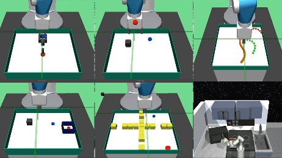
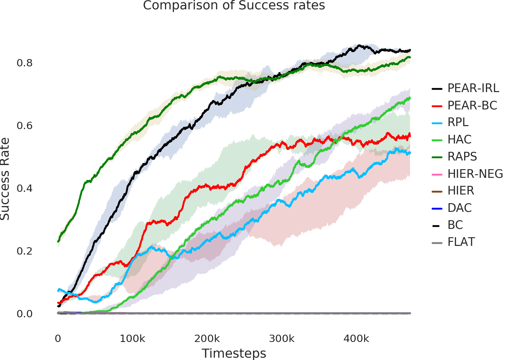
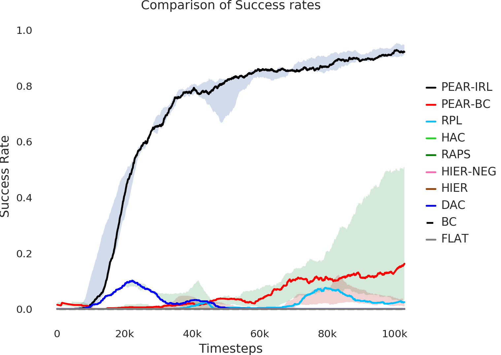
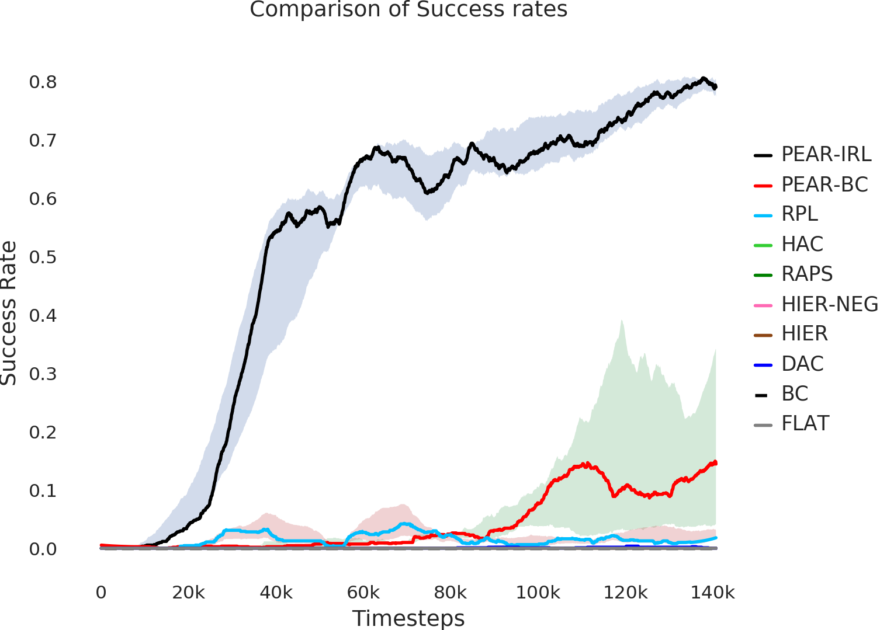
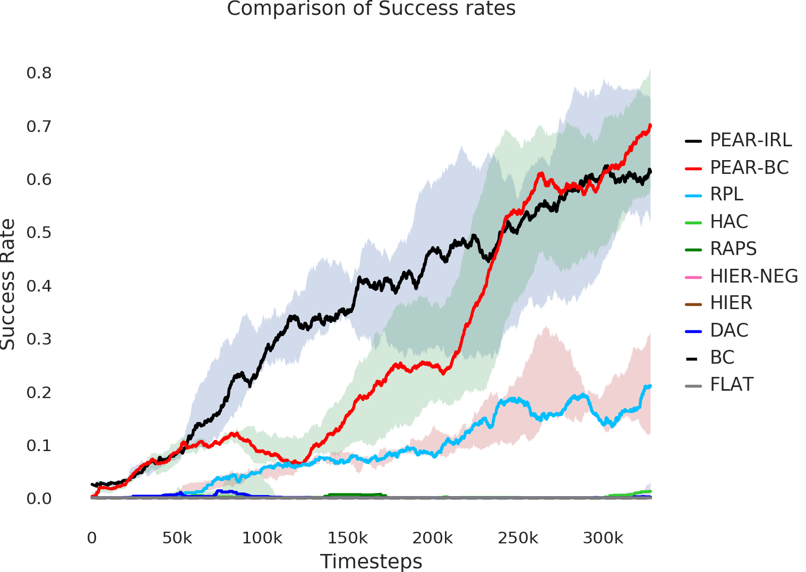
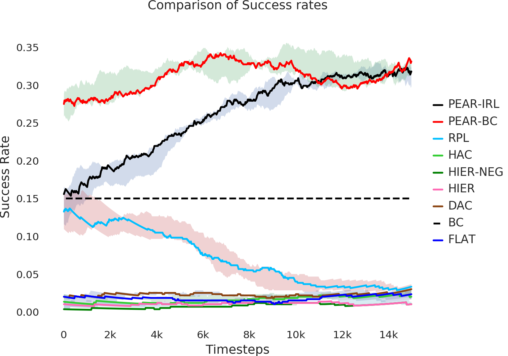
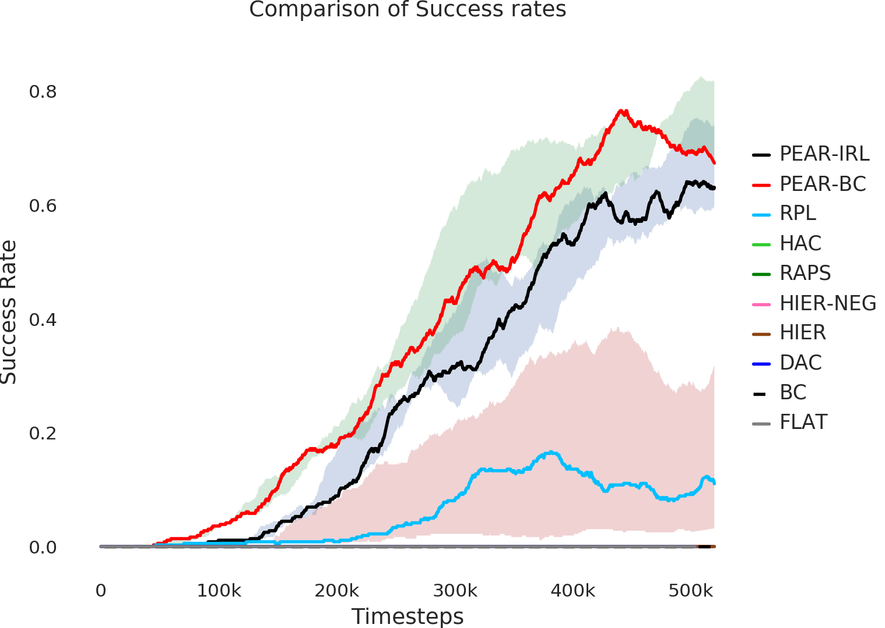

## CRISP: Curriculum inducing Primitive Informed Subgoal Prediction
### Code repository for CRISP



This is a tensorflow based implementation for our approach: Curriculum inducing Primitive Informed Subgoal Prediction. The approach deals with non-stationarity in hierarchical reinforcement learning by generating primitive informed subgoal dataset for higher level, and subsequently applying inverse reinforcement learning regularization with the reinforcement learning objective.

### 1) Installation and Usage
This code is based on [TensorFlow](https://www.tensorflow.org/). To install, run these commands:
  ```Shell
  # install the code
  git clone -b master --single-branch https://github.com/Utsavz/CRISP.git
  virtualenv crisp
  source $PWD/crisp/bin/activate
  pip install numpy
  pip install -r src/requirements.txt

  # download models and data
  bash download.sh
  ```

### 2). Running demo
To run the demo, use the following scripts:
  ```Shell
  # For Maze navigation environment
  python experiment/play.py --dir=maze_crisp_0 --render=1 --rollouts=10

  # For Pick and place environment
  python experiment/play.py --dir=pick_crisp_0 --render=1 --rollouts=10

  # For bin environment
  python experiment/play.py --dir=bin_crisp_0 --render=1 --rollouts=10

  # For hollow environment
  python experiment/play.py --dir=hollow_crisp_0 --render=1 --rollouts=10

  # For rope manipulation environment
  python experiment/play.py --dir=rope_crisp_0 --render=1 --rollouts=10

  # For Franka kitchen environment
  python experiment/play.py --dir=kitchen_crisp_0 --render=1 --rollouts=10


  ```

### 3). Training code
To train, use the following scripts. For baselines, change the parameters accordingly:
  ```Shell
  # For Maze navigation environment
  python experiment/train.py --env="FetchMazeReach-v1" --logdir="pick_crisp_0" --n_epochs=2100 --num_cpu=1 --seed=0 --bc_loss=1 --bc_loss_upper=1  --adversarial_loss=1 --num_hrl_layers=2 --populate=1

  # For Pick and place environment
  python experiment/train.py --env="FetchPickAndPlace-v1" --logdir="pick_crisp_0" --n_epochs=2100 --num_cpu=1 --seed=0 --bc_loss=1 --bc_loss_upper=1  --adversarial_loss=1 --num_hrl_layers=2 --populate=1

  # For bin environment
  python experiment/train.py --env="FetchPickAndPlaceBin-v1" --logdir="bin_crisp_0" --n_epochs=2200 --num_cpu=1 --seed=0 --bc_loss=1 --bc_loss_upper=1  --adversarial_loss=1 --num_hrl_layers=2 --populate=1

  # For hollow environment
  python experiment/train.py --env="FetchPickAndPlaceHollow-v1" --logdir="hollow_crisp_0" --n_epochs=3500 --num_cpu=1 --seed=0 --bc_loss=1 --bc_loss_upper=1  --adversarial_loss=1 --num_hrl_layers=2 --populate=1

  # For rope manipulation environment
  python experiment/train.py --env="RoboticRope-v1" --logdir="rope_crisp_0" --n_epochs=600 --num_cpu=1 --seed=0 --bc_loss=1 --bc_loss_upper=1  --adversarial_loss=1 --num_hrl_layers=2 --populate=1

  # For Franka kitchen environment
  python experiment/train.py --env="kitchen-complete-v0" --logdir="kitchen_crisp_0" --n_epochs=1900 --num_cpu=1 --seed=0 --bc_loss=1 --bc_loss_upper=1  --adversarial_loss=1 --num_hrl_layers=2 --populate=1

  
  ```

### 3). Plot progress
To plot the success rate performances, use the following scripts:
  ```Shell
  # For Maze navigation environment
  python experiment/plot.py --dir1=maze_crisp_0:crisp --plot_name="maze"

  # For Pick and place environment
  python experiment/plot.py --dir1=pick_crisp_0:crisp --plot_name="pick"

  # For bin environment
  python experiment/plot.py --dir1=bin_crisp_0:crisp --plot_name="bin"

  # For hollow environment
  python experiment/plot.py --dir1=hollow_crisp_0:crisp --plot_name="hollow"

  # For rope manipulation environment
  python experiment/plot.py --dir1=rope_crisp_0:crisp --plot_name="rope"

  # For Franka kitchen environment
  python experiment/plot.py --dir1=kitchen_crisp_0:crisp --plot_name="kitchen"

  
  ```

### 4). Results: Success rate performance
Here we provide the success rate performance results for various environments:

  #### Maze navigation environment

  

  #### Pick and place environment

  

  #### Bin environment

  

  #### Hollow environment

  

  #### Rope manipulation environment

  

  #### Franka kitchen environment

  